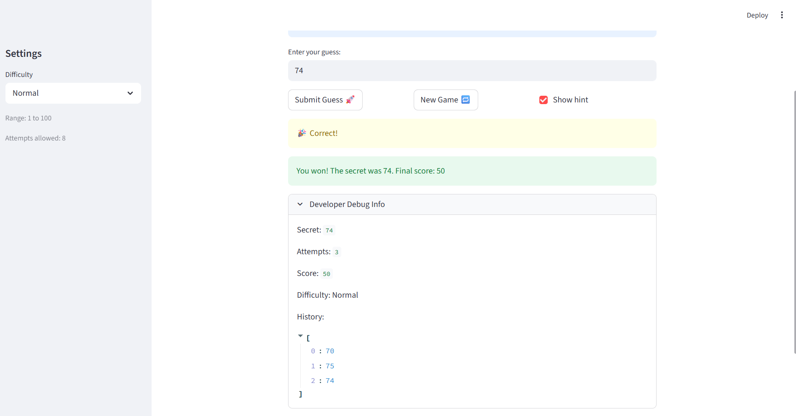

# 🎮 Game Glitch Investigator: The Impossible Guesser

## 🚨 The Situation

You asked an AI to build a simple "Number Guessing Game" using Streamlit.
It wrote the code, ran away, and now the game is unplayable. 

- You can't win.
- The hints lie to you.
- The secret number seems to have commitment issues.

## 🛠️ Setup

1. Install dependencies: `pip install -r requirements.txt`
2. Run the broken app: `python -m streamlit run app.py`

## 🕵️‍♂️ Your Mission

1. **Play the game.** Open the "Developer Debug Info" tab in the app to see the secret number. Try to win.
2. **Find the State Bug.** Why does the secret number change every time you click "Submit"? Ask ChatGPT: *"How do I keep a variable from resetting in Streamlit when I click a button?"*
3. **Fix the Logic.** The hints ("Higher/Lower") are wrong. Fix them.
4. **Refactor & Test.** - Move the logic into `logic_utils.py`.
   - Run `pytest` in your terminal.
   - Keep fixing until all tests pass!

## 📝 Document Your Experience

- [ ] The game's purpose is to let the user guess the secret number. The user chooses a number from a range and will be givedn some amount of attempts to guess the secret number. The user will also be given hints to decide if they should guess higher or lower depending on their last guess. Points will be deducted for each wrong guess. The user can you also change difficulty levels.
- [ ] The bugs I found where that the hints were opposite to what they are supposed to be. Another bug that i found was that the scoring logic wasn't working properly. It was dependent on if the guess was even or odd and would sometimes increase points and then other times decrease it. The third buy I found was that the attempt number always started at 1 when it should start at 0.
- [ ] I fixed all three bugs. For the hints I just had to change the print statements to match the logic since they were backwards. The second fix I made was to deduct points for each wrong guess instead of making it depend on if it was even or odd. The third bug I just had to set the variable to 0.

## 📸 Demo

- [ ] 

